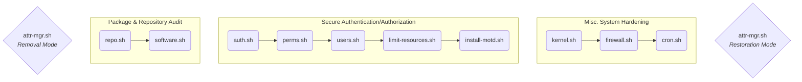

# Hardening Script(s)

> [!CAUTION]
>
> Works best on headless Linux servers—may break home desktops.

Over-engineered script for securing Linux machines

## Recommended Execution Flow

```mermaid
graph LR
	1{attr-mgr.sh <br><i>Removal Mode</i>}

	subgraph Package & Repository Audit
		2(repo.sh) --> 3(software.sh)
	end

	subgraph Secure Authentication/Authorization
		4(auth.sh) --> 5(perms.sh) --> 6(users.sh) --> 7(limit-resources.sh) --> 8(install-motd.sh)
	end

	subgraph Misc. System Hardening
		9(kernel.sh) --> 10(firewall.sh) --> 11(cron.sh)
	end

	12{attr-mgr.sh <br><i>Restoration Mode</i>}

	1 ~~~ 2
	3 ~~~ 4
	8 ~~~ 9
	11 ~~~ 12
```